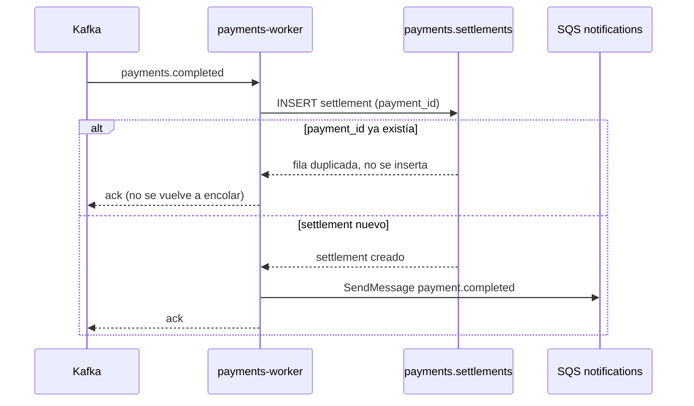

# payments-worker

Consume `payments.completed` de Kafka, registra el settlement y encola la notificación al
cliente en SQS. Nació para sacar el envío de notificaciones del request síncrono de
`POST /v1/payments`: antes lo hacía payments-api en el mismo hilo del pago, ahora es asíncrono y
no le agrega latencia a nadie que esté pagando.

Somos el equipo **payments**. Dueños del código: Lucía Benítez, Diego Paz.

## Qué hace

Un solo `@KafkaListener`, un solo topic: `<KAFKA_TOPIC_PREFIX>payments.completed`, consumer group
`payments-worker`. Por cada evento:

1. Inserta una fila en `settlements` (misma base `payments` que payments-api, tabla propia de
   este servicio).
2. Si la fila era nueva, encola un mensaje en `<SQS_QUEUE_PREFIX>notifications` para que
   `notifications` le avise al cliente.



## Base de datos

`payments` es la base de payments-api, no nuestra: nosotros solo somos dueños de la tabla
`settlements` ahí adentro. Por eso corremos Flyway con historia propia (`flyway_schema_history_worker`,
ver `application.yml`) en vez de la default — si compartiéramos `flyway_schema_history` con
payments-api, el segundo servicio en arrancar contra esa base moriría con
`FlywayValidateException` (Flyway ve el mismo `V1` con otro checksum y lo trata como corrupción).
Con historia propia, la primera vez arrancamos contra un schema que ya tiene las tablas de
payments-api pero no nuestra `flyway_schema_history_worker`: por eso `baseline-on-migrate: true`,
que nos permite crear nuestra historia y aplicar `V1__settlements` sin tocar nada ajeno.

## Idempotencia

`settlements.payment_id` es `unique`. Antes de insertar, `SettlementService` chequea si ya existe;
si el insert igual pisa el constraint (dos entregas del mismo mensaje pisándose, típico de un
rebalance de partición), se atrapa la `DataIntegrityViolationException` y se trata como duplicado.
En ningún caso de duplicado se vuelve a mandar el mensaje a SQS — la notificación al cliente
también tiene que ser idempotente, y la forma más simple de lograrlo es no reintentar lo que ya se
mandó.

Esto es lo único que nos importa para no mandarle a alguien dos veces el mismo "tu pago se
completó": no hay deduplicación en SQS ni en el lado de `notifications`, toda la garantía vive acá.

## Si SQS no responde

`NotificationQueue.enqueue` no atrapa los errores del `SqsClient` para reintentar solo; los deja
propagar. Eso hace que el `@KafkaListener` termine con excepción, y con `AckMode.RECORD` +
`ENABLE_AUTO_COMMIT=false` el offset de esa partición **no avanza**. El `DefaultErrorHandler` tiene
un backoff fijo de 2s con reintentos ilimitados (`FixedBackOff.UNLIMITED_ATTEMPTS`): el mismo
record se reintenta para siempre hasta que SQS (o LocalStack) vuelva a responder. No hay
dead-letter ni skip automático para este tipo de falla — si SQS está caído mucho tiempo, el
consumer group se queda pegado en esa partición y las notificaciones futuras se acumulan en Kafka
sin perderse. Eso es lo que queremos: preferimos atrasar notificaciones a perderlas.

(La única falla que sí se salta sin reintentar es un mensaje que no deserializa — un poison pill.
Reintentarlo para siempre no lo va a arreglar, así que Spring Kafka lo loguea y sigue. Nos pasó una
vez en desarrollo por un `ObjectMapper` sin el módulo de Kotlin registrado; quedó cubierto por
`KafkaConfigTest`.)

## Corriendo local

Necesitás Postgres (`payments`), Kafka y LocalStack (SQS) accesibles — en el cluster de desarrollo
ya están en `platform`. Con eso:

```bash
export SERVICE_NAME=payments-worker ENV=staging PORT=8080 LOG_LEVEL=INFO
export DB_HOST=localhost DB_NAME=payments DB_USER=cauri DB_PASSWORD=cauri
export KAFKA_BOOTSTRAP=localhost:9092 KAFKA_TOPIC_PREFIX=staging.
export AWS_ENDPOINT_URL=http://localhost:4566 AWS_REGION=us-east-1
export AWS_ACCESS_KEY_ID=test AWS_SECRET_ACCESS_KEY=test SQS_QUEUE_PREFIX=staging-

./gradlew bootRun
```

Las migraciones de Flyway (`src/main/resources/db/migration`) corren solas al arrancar. No expone
ninguna API propia: solo `/actuator/health` y `/actuator/prometheus`.

## Tests

```bash
./gradlew test
```

`PaymentCompletedListenerTest` cubre el contrato completo con un repositorio H2 real (modo
PostgreSQL) y un `SqsClient` mockeado con MockK: un evento crea el settlement y encola, el mismo
evento dos veces no duplica el settlement ni vuelve a encolar. `KafkaConfigTest` deserializa un
payload real de payments-api para no repetir el bug del `ObjectMapper` sin módulo de Kotlin.

## Deployments

GitOps, igual que payments-api: `build.yml` buildea la imagen, la pushea a
`ghcr.io/demo-org-np-migration/payments-worker` y bumpea el tag en el repo `gitops`
(`apps/payments-worker/values-staging.yaml` en cada push a `main`, `values-prod.yaml` al taggear
`v*`). Argo CD sincroniza desde ahí. El chart vive en `chart/`; sus `values.yaml` son los defaults
de staging, no los valores reales de cada entorno.

## Variables de entorno

`SERVICE_NAME`, `ENV`, `PORT`, `LOG_LEVEL`, `DB_HOST`, `DB_NAME`, `DB_USER`, `DB_PASSWORD`,
`KAFKA_BOOTSTRAP`, `KAFKA_TOPIC_PREFIX`, `AWS_ENDPOINT_URL`, `AWS_REGION`, `AWS_ACCESS_KEY_ID`,
`AWS_SECRET_ACCESS_KEY`, `SQS_QUEUE_PREFIX`. Ver `chart/values.yaml` para los defaults y
`las convenciones internas de API` para el detalle de cada una.
